# 웹 접근성

## 웹페이지 선정

제가 선정한 웹페이지는 바하마 우체 서비스 사이트에 있는 EMS 배달 예상 소요 시간 페이지입니다. [사이트 바로가기](https://www.bahamas.gov.bs/wps/portal/public/Express%20Mail%20Service/Delivery%20Time/!ut/p/b1/vZPZjqNIEEW_pT6AIpMlMY9AYsCQ2Gw28GJhY7N7w2b7-vaMShqNWl310iLiKaWbOnGvIuiYDun4knRFljyL6yWp_3nHaO_IwPEskZU0wRKA4Qs-Mg0MiMzTOzrUo8nCV5ItVXc_ONCSarNOn5doWDwiF59Q4sidsAOB4lr-_sKs7nzjk-Gya0Uh4oh5SCM3FE8wtspEwpFb-toif1bn9Gn453pkx87qHpCtI4hcb60ENiUBW9WRrJw2TS04nMv4A4MqV67z4YnbWF9ml5AzHretmSisVmiBvE7j69nU3ETvU9dTat_OT-fFII7mxejfJqO3SfCHksC3GRD09f8bwY8Zxv9KWKARSeIWROMBAkawsaSNoDNrDnwJvhvx-yE5OnoLhD8LBNqnQ8DtvXK8GVM1uSUYyLOUen-ybejvRk9lPdtXGWKvoY-jAZQB8HyXkKqC9hTbdoo36dYN5LcDAY_sD0AVzQ3kZwYGYG4gMzcQzg2ce0shNzfw75_Fio6LQ_PZH5tP8MlxC5FdiBwvCkgUGYajt6tjNihXqccqdtspr-y4TmU_HR4eKp5NkR8iQ9s1VIc2zlnvmXWOrsBRJZ4X712bcpx0CyKQBdUKttmLKornVGRlvEY3nIumcdXuMoVeZ7CvdFFYdalJLQ1ygoFo-aGpZR8ftK1fm9MPuWzY33KZXItMK8NXewBxAMnDCuygfvvf2qR0IKwA9ILr6E_aSDCZiOh_5YKz58OpfgDyzNxAODdQmBlozR2p9fcj_d8xIbTg-HdxUGDRgkX0tgyQgFujx5txa-XotjmQPMxeV28NndddAXh3r7qVF206dLqrg4HVgeUFW8yn8CQzyV52zORW1OHjWAkxJzdXBqiLVoeOBbM-eoXOipksBZYtb8atk6Dl_azvS6IHWYPr6JIWD0NZP9ohOdhoECtd29nMMrhdbs5YoqdlZaJzF7whvgWjRy2p2jscXDyZlUItFIVne7h7bE-uphZpzvVHW2OSM6bq4wvWFH8nZ0vIYDK28ZG-NZ1pIVefwt_6pHXNfy19fPwCo8Gkng!!/dl4/d5/L2dBISEvZ0FBIS9nQSEh/)

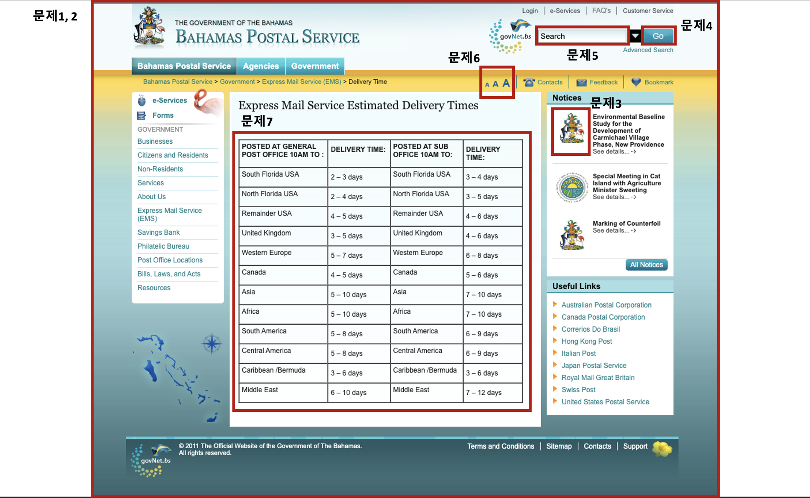

## 기존 서비스의 문제점 분석 및 수정 방안

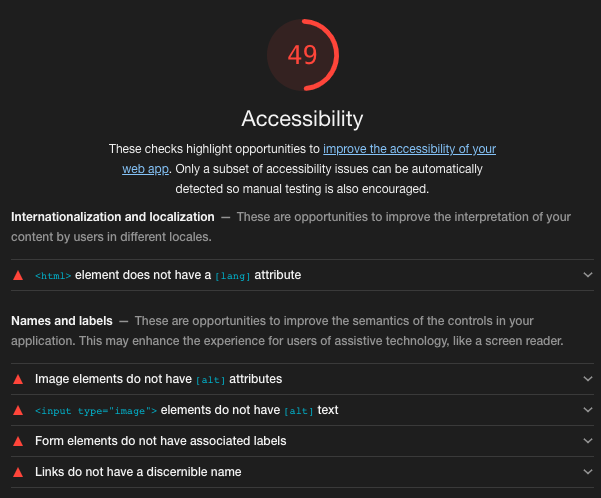

바하마 우체 서비스 사이트를 Lighthouse를 통해 검사한 결과 매우 낮은 점수를 받았습니다.
해당 사이트의 문제점들을 하나하나씩 살펴보겠습니다.

### 문제점1 - 시멘틱하지 않은 웹

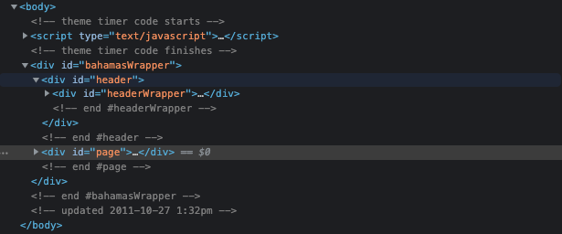

#### 문제점

위 사이트는 header, nav, main, footer, h1, h2 등을 사용하지 않아 의미론적인 웹의 구조를 지니지 않았습니다.<br>
사진의 html 코드를 보면 `header` 대신 `<div id="header">` 사용하는 등 `<div>`의 나열로 구성되어 있어 웹 구조상 아쉬움을 갖고 있습니다.
시멘틱하지 않은 웹은 해당 사이트의 웹 구조를 파악하는데 어려움을 줍니다.

#### 수정방안

웹 구조에 따라 `header`, `main`, `footer`등으로 나눠야합니다. 콘텐츠에 따라 `h1`, `h2`, `h3` 등의 head를 작성해야합니다.

#### 수정계획

웹 구조가 쉽게 파악할 수 있도록 콘텐츠를 나눠 구조를 재구성하겠습니다. <br>
<br>
`header`에는 상단메뉴, 로고, 서치바, 네비게이션 바로 구성되도록 하며, 로고를 `h1`으로, 네비게이션 바에 `nav` 및 `h2`(mainNav)를 주도록 하겠습니다. <br>
<br>
본문 좌측 보조 네비게이션바에 `nav` 및 `h2`(subNav)를 주도록하겠습니다.
우측 바는 Notice 및 Useful Links로 구성되어있습니다. Notice는 다른 사이트에서도 사용할 수도 있기에 `article`로 둘러쌓겠습니다. <br>
중앙의 콘텐츠는 `main`을 주어 사이트의 메인 콘텐츠를 알리며, 해당 콘텐츠의 제목(`h2`)과 소제목(`h3`) 등으로 나누어 작성하겠습니다.<br>
<br>
`footer`은 가장 아래에 작성하겠습니다.

### 문제점2 - 기본 언어 미설정

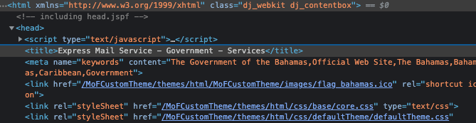

#### 문제점

기본 언어가 설정되어 있지 않아 스크린 리더기가 언어를 파악하는데 문제를 생길 수 있는 등 웹접근성 면에서 부족합니다.<br>
기본언어 미설정은 해당 사이트 번역에 문제를 일으킬 수 있습니다.

#### 수정방안

기본 언어를 설정하기 위해서는 `<html>` 엘리먼트에 `lang`속성값을 주겠습니다.<br>

```html
<html lang="eu"></html>
```

#### 수정계획

바하마 우편 서비스 사이트는 영어를 사용하기에 `lang`속성값으로 영어를 줘야합니다.

### 문제점3 - 특정 이미지 내 alt 속성 부재

```html

```

#### 문제점

`img` 태그 내 `alt` 속성 값이 없습니다. `alt` 속성값이 없는 경우, 이미지를 불러오지 못하거나 또는 스크린 리더기 사용자들이 해당 이미지가 무슨 콘텐츠인지 알 수가 없어 문제가 생길 수 있습니다.

#### 수정방안

`alt` 속성값으로 해당 이미지에 대한 짧은 설명(목적 및 의미)을 작성해야합니다.<br>
만약에 해당 이미지가 콘텐츠로서의 기능이 아닌 꾸미기를 위한 용도면 `alt=""`를 줘도 됩니다.

```html


```

#### 수정계획

사이트 존재하는 `img`들은 용도를 지니기 때문에 해당 콘텐츠에 맞는 설명을 추가하도록 하겠습니다.<br>

### 문제점4 - 이미지 버튼 내 alt 속성 부재

```html
<input
  id="searchGo"
  type="image"
  src="생략"
  width="51"
  height="24"
  onclick="return monitor(this)"
/>
```

#### 문제점

이미지 버튼 내에 `alt` 속성값이 부재할 시 스크린 리더기 사용자들은 해당 버튼을 사용함에 있어 어려움을 겪을 수 있습니다. 이미지를 불러오지 못할 경우에도 `alt` 속성값이 부재할 시 어려움을 겪을 수 있습니다.

#### 수정방안

`alt` 속성값으로 해당 버튼 클릭 시 어떤 액션이 일어나는지 짧은 설명을 작성해야합니다.<br>

```html
<form>
  <label>
    Username:
    <input type="text" />
  </label>
  <input type="image" alt="Sign in" src="./sign-in-button.png" />
</form>
```

#### 수정계획

해당 사이트의 이미지 버튼은 굳이 이미지 버튼일 필요가 없기 때문에 일반 버튼으로 전환하고 `alt`속성값을 주도록 하겠습니다..

### 문제점5 - 폼 라벨 부재

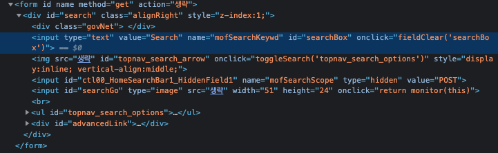

#### 문제점

`input[type="search"]`과 같은 폼 컨트롤 요소에 폼 라벨이 부재할 시에 스크린 리더 사용자들은 해당 폼 컨트롤 요소의 목적을 알 수가 없습니다.

#### 수정방안

`input` 요소에 대한 설명을 할 수 잇는 `label`엘리먼트를 추가해야합니다.

```html
<input id="promo" type="checkbox" />
<label for="promo">Receive promotional offers?</label>
```

#### 수정계획

검색창의 경우 `label`이 직접적으로 드러나면 디자인상 문제가 될 수 있기에 작성후 `display:none` 처리하도록 하겠습니다.

### 문제점6 - 링크 내 텍스트 값 부재

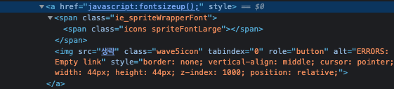

#### 문제점

`a link` 태그 내에 텍스트 값이 없는 경우 사용자들에게 해당 링크가 무엇인지 전달하는데 어려움이 있을 수 있습니다. 또한 키보드 및 스크린 리더 사용자들에게도 해당 링크의 목적을 전달하는데에 어려움을 줄 수 있습니다.

#### 수정방안

링크에 대한 설명이 잘 나타나도록 작성하도록 해야합니다.

```html
Check out <a href="…">our guide to creating accessible web pages</a>.
</html>
```

#### 수정계획

문제의 링크의 경우 특정 자바스크립트 함수를 실행하기 위한 용도이기애 버튼으로 대체하겠습니다.

### 문제점7 - 레이아웃 테이블

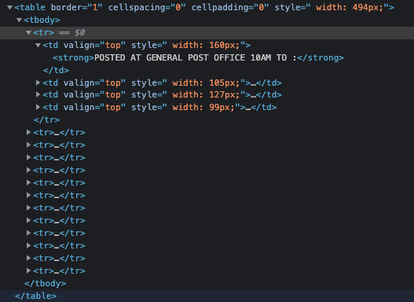

#### 문제점

레이아웃 테이블이란 `th`, `caption`, `scope` 등을 사용하지 않은 테이블입니다.
`th`, `scope` 등 테이블 데이터 요소들에 대한 정보가 없는 경우 스크린 리더기 사용자들은 해당 테이블을 이해하는데 큰 어려움을 겪을 수 있습니다.

#### 수정방안

데이터 테이블로 전환하기 위해 `th`, `caption`, `scope` 등을 활용하여 해당 테이블에 대한 부가적인 정보를 작성해야합니다. <br>
레이아웃 테이블의 경우 다른 html요소와 css를 통해 해당 내용을 충분히 나타낼 수 있습니다. 레이아웃 테이블을 사용해야한다면 `role="presentation"`을 작성해서 해당 테이블이 데이터 테이블이 아님을 알려야합니다.

#### 수정계획

위 사이트의 테이블을 데이터 테이블로 전환하기 위해 `th`, `caption`, `scope` 등의 요소를 활용하겠습니다. 또한 중복되는 데이터들이 있기에 중복 데이터들을 제거하여 새로 재구성하겠습니다.

## 웹 접근성 관련 체크리스트 작성

### 인식의 용이성

| 지침             | 검사목록                                                                                                                         | 체크박스 |
| ---------------- | :------------------------------------------------------------------------------------------------------------------------------- | :------: |
| 대체 텍스트      | 텍스트 아닌 콘텐츠는 그 의미나 용도를 인식할 수 있도록 도와줄 수 있는 대체 텍스트를 제공해야 합니다                              |    x     |
| 시간 기반 미디어 | 오디오, 비디오 등의 시간 기반 미디어 콘텐츠는 자막, 대본 또는 수화 등 해당 콘텐츠를 이해할 수 있는 대체 콘텐츠를 제공해야합니다. | 해당없음 |
| 적용가능         | 사용자는 콘텐츠의 구조를 쉽게 이해할 수 있도록 해야합니다.                                                                       |    x     |
| 식별가능         | 콘텐츠는 사용자가 더 쉽게 보고 들을 수 있도록 제작되어야 한다.                                                                   |    ㅇ    |

- 몇몇의 `img`에 대체 텍스가 부재합니다
- 웹 구조가 시멘틱하지 않아 콘텐츠의 구조를 이해하는데 어려움이 있을 수 있습니다.

### 운용의 용이성

| 지침                | 검사목록                                                                                      | 체크박스 |
| ------------------- | :-------------------------------------------------------------------------------------------- | :------: |
| 키보드 접근성       | 키보드 사용에 문제가 없어야 합니다                                                            |    ㅇ    |
| 충분한 시간         | 사용자가 콘텐츠를 읽고 사용할 수 있도록 충분한 시간을 제공해야합니다.                         |    ㅇ    |
| 발작 및 신체적 반응 | 콘텐츠가 발작 또는 신체적 반응을 일으키지 않도록 설계되어야 합니다                            |    ㅇ    |
| 쉬운 내비게이션     | 사용자에게 네비게이션하고, 콘텐츠를 찾고, 현재 위치를 파악할 수 있는 방법을 제공해야합니다    |    x     |
| 입력방식            | 사용자가 키보드 이외의 다양한 입력 장치를 통해 기능들을 보다 쉽게 조작할 수 잇도록 해야합니다 |    ㅇ    |

- 키보드 및 다른 입력 장치 사용에 문제가 없습니다.
- 콘텐츠에 시간 제한 없으며, 발작 및 신체적 반응을 일으킬 문제 또한 없습니다.
- heading이 부재하여 네비게이션 기능에 문제가 있을 수 있습니다.

### 이해의 용이성

| 지침       | 검사목록                                                                    | 체크박스 |
| ---------- | :-------------------------------------------------------------------------- | :------: |
| 가독성     | 텍스트 콘텐츠를 읽고 이해할 수 있도록 해야합니다.                           |    x     |
| 예측가능성 | 웹 페이지는 예측 가능한 방식으로 제시되고 작동해야합니다.                   |    ㅇ    |
| 입력지원   | 사용자가 입력 및 제출 시 실수를 회피하거나 수정할 수 있도록 지원해야합니다. |    x     |

- 웹페이지에 기본언어에 대한 설정이 부재하여 가독성에 문제가 생길 수 있습니다.
- 특정 `input`에 레이블이 부재하여 입력에 대한 지시문이 부재합니다.

### 견고성

| 지침   | 검사목록                                                                              | 체크박스 |
| ------ | :------------------------------------------------------------------------------------ | :------: |
| 호환성 | 마크업 문법상 오류가 없으며, 현재나 미래의 사용자가 에이전트와의 호환성 높아야합니다. |    ㅇ    |

- 호환성에 문제가 없어보입니다.

## 재구현한 서비스

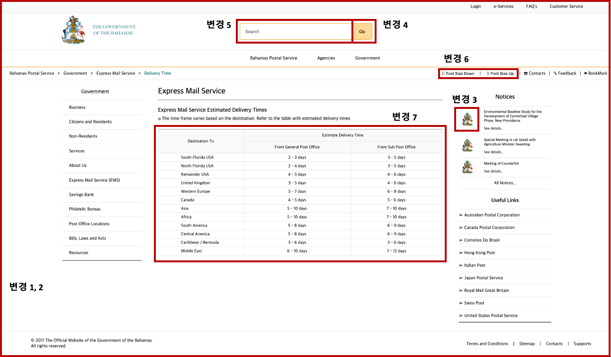

### 변경1 - 시멘틱 웹

웹 구조를 시멘틱한 구조로 다시 바꿨습니다. <br>
링크를 통해 변경한 html 구조를 확인할 수 있습니다. [변경한 html](./index.html)

### 변경2 - 기본 언어 설정

```html
<html lang="en"></html>
```

html에 `lang`속성을 활용하여 기본 언어를 설정했습니다. <br>
line2에 기본 언어를 작성했음을 확인할 수 있습니다.

### 변경3 - img태그와 alt속성

```html

```

`img`태그에 `alt`속성 값을 줬습니다. <br>
line192에 변경했음을 확인할 수가 있습니다.

### 변경4 - 이미지 버튼과 alt속성

```html
<input
  type="submit"
  name="searchButton"
  value="Go"
  title="search button"
  alt="click button to search"
/>
```

굳이 이미지를 활용 안해도 되기에 이미지 타입 `input`엘리먼트를 버튼 타입으로 변경했습니다. <br>
line38에 확인할 수가 있습니다.

### 변경5 - input과 label

```html
<label for="searchInput" class="displayNone">Search for information...</label>
<input
  type="search"
  id="searchInput"
  name="searchInput"
  placeholder="Search"
  title="Search"
/>
```

서치 타입 `input` 엘리먼트와 한쌍인 `label`을 작성했습니다. 검색창은 디자인 상 라베을 나타내지 않은 것이 더 좋기에 css `display:none`으로 설정했습니다. <br>
line36-37에 확인 가능합니다.

### 변경6 - a 링크와 텍스트 값

```html
<ul>
  <li><button>&#x21e9; Font Size Down</button></li>
  <li class="nextIcon">|</li>
  <li><button>&#x21e7; Font Size Up</button></li>
</ul>
```

특정 자바스크립트 함수를 사용하기 위한 용도이기에 `a`태그에서 `button`으로 수정했습니다.
<br>
line66-68에 확인 가능합니다.

### 변경7 - 데이터 테이블

```html
<table>
  <caption>
    express mail service estimated delivery times based on delivery area,
    delivery date differs between general post office and sub post office
  </caption>
  <thead>
    <tr>
      <th scope="col" rowspan="2">Destination To</th>
      <th scope="col" colspan="2">Estimate Delivery Time</th>
    </tr>
    <tr>
      <th scope="col">From General Post Office</th>
      <th scope="col">From Sub Post Office</th>
    </tr>
  </thead>
  <tbody>
    <tr>
      <th scope="row">South Florida USA</th>
      <td>2 - 3 days</td>
      <td>3 - 5 days</td>
    </tr>
    <tr>
      <th scope="row">North Florida USA</th>
      <td>2 - 4 days</td>
      <td>3 - 5 days</td>
    </tr>
    <tr>
      <th scope="row">Remainder USA</th>
      <td>4 - 5 days</td>
      <td>4 - 6 days</td>
    </tr>
    <tr>
      <th scope="row">United Kingdom</th>
      <td>3 - 5 days</td>
      <td>4 - 6 days</td>
    </tr>
    <tr>
      <th scope="row">Western Europe</th>
      <td>5 - 7 days</td>
      <td>6 - 8 days</td>
    </tr>
    <tr>
      <th scope="row">Canada</th>
      <td>4 - 5 days</td>
      <td>5 - 6 days</td>
    </tr>
    <tr>
      <th scope="row">Asia</th>
      <td>5 - 10 days</td>
      <td>7 - 10 days</td>
    </tr>
    <tr>
      <th scope="row">Africa</th>
      <td>5 - 10 days</td>
      <td>7 - 10 days</td>
    </tr>
    <tr>
      <th scope="row">South America</th>
      <td>5 - 8 days</td>
      <td>6 - 9 days</td>
    </tr>
    <tr>
      <th scope="row">Central America</th>
      <td>5 - 8 days</td>
      <td>6 - 9 days</td>
    </tr>
    <tr>
      <th scope="row">Caribbean / Bermuda</th>
      <td>3 - 6 days</td>
      <td>3 - 6 days</td>
    </tr>
    <tr>
      <th scope="row">Middle East</th>
      <td>6 - 10 days</td>
      <td>7 - 12 days</td>
    </tr>
  </tbody>
</table>
```

기존 테이블에서 중복되는 값들이 있기에 테이블의 헤드 부분을 재구성했습니다.
<br>
`thead`와 `tbody`로 나누었으며, `th`에는 `scope`에 대한 정보를 제공했습니다.
또한 `caption`을 활용하여 테이블의 목적 및 기능을 설명했습니다.
<br>
line 105 - 181에 확인가능합니다.

## 문법 검사 결과

### html 문법 검사

W3C Markup Validation Service에서 검사한 html 문법검사 결과입니다.<br>
검사결과 문법 오류 없이 통과했습니다.

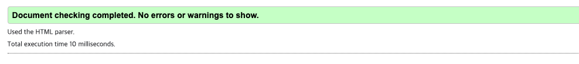

### css 문법 검사

W3C CSS Validation Service에서 검사한 css 문법검사 결과입니다.<br>
검사결과 마찬가지로 문법 오류 없이 통과했습니다.

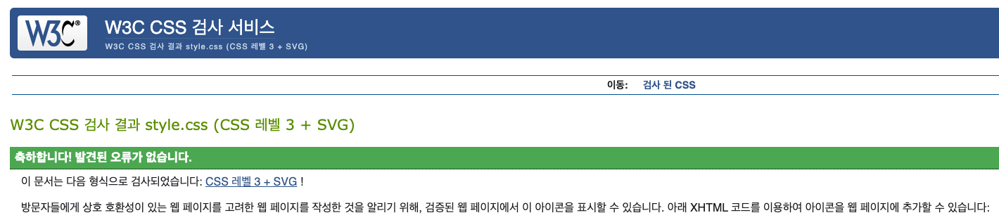

## 라이트하우스

라이트하우스 검사결과입니다.<br>
검사결과 오류를 발견하지 않았습니다.

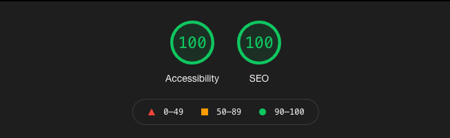

## 프로젝트 완료 후기

어떻게 고쳐야 웹접근성이 높아질 수 있을지에 대하여 고민할 수 있는 기회였습니다. 전에는 웹접근성에 대해 생각을 많이 안했기에 시멘틱한 웹구조, `th`, `label` 등의 요소들에 대한 의미와 중요성에 깊게 생각을 한 적이 없었습니다. 그러나 이번 프로젝트를 통해 관련 여러 글들을 읽고, 직접 html을 작성하며 웹접근성이 무엇인지 더 자세히 알게 되었다고 생각합니다. 열심히 작성했지만 제가 작성한 html과 css에 미처 몰랐던 부분들, 고쳐야할 부분들이 있다고 생각합니다. 특히 반응형 웹에 대해 전혀 신경을 안써서 매우 엉망입니다... 관련 피드백을 주시면 매우 감사하겠습니다.
