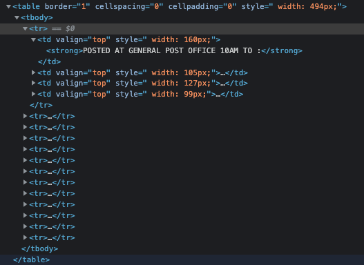
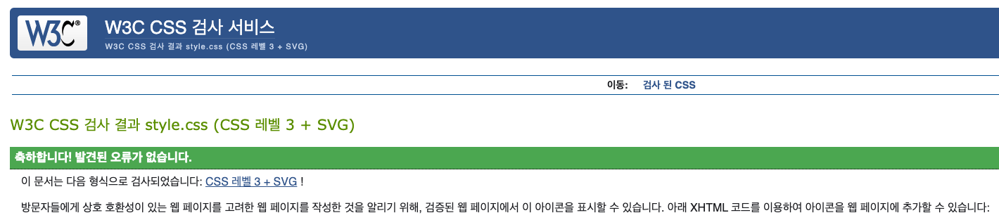

# 웹 접근성

## 웹페이지 선정

제가 선정한 웹페이지는 바하마 우체 서비스 사이트에 있는 EMS 배달 예상 소요 시간 페이지입니다. [사이트 바로가기](https://www.bahamas.gov.bs/wps/portal/public/Express%20Mail%20Service/Delivery%20Time/!ut/p/b1/vZPZjqNIEEW_pT6AIpMlMY9AYsCQ2Gw28GJhY7N7w2b7-vaMShqNWl310iLiKaWbOnGvIuiYDun4knRFljyL6yWp_3nHaO_IwPEskZU0wRKA4Qs-Mg0MiMzTOzrUo8nCV5ItVXc_ONCSarNOn5doWDwiF59Q4sidsAOB4lr-_sKs7nzjk-Gya0Uh4oh5SCM3FE8wtspEwpFb-toif1bn9Gn453pkx87qHpCtI4hcb60ENiUBW9WRrJw2TS04nMv4A4MqV67z4YnbWF9ml5AzHretmSisVmiBvE7j69nU3ETvU9dTat_OT-fFII7mxejfJqO3SfCHksC3GRD09f8bwY8Zxv9KWKARSeIWROMBAkawsaSNoDNrDnwJvhvx-yE5OnoLhD8LBNqnQ8DtvXK8GVM1uSUYyLOUen-ybejvRk9lPdtXGWKvoY-jAZQB8HyXkKqC9hTbdoo36dYN5LcDAY_sD0AVzQ3kZwYGYG4gMzcQzg2ce0shNzfw75_Fio6LQ_PZH5tP8MlxC5FdiBwvCkgUGYajt6tjNihXqccqdtspr-y4TmU_HR4eKp5NkR8iQ9s1VIc2zlnvmXWOrsBRJZ4X712bcpx0CyKQBdUKttmLKornVGRlvEY3nIumcdXuMoVeZ7CvdFFYdalJLQ1ygoFo-aGpZR8ftK1fm9MPuWzY33KZXItMK8NXewBxAMnDCuygfvvf2qR0IKwA9ILr6E_aSDCZiOh_5YKz58OpfgDyzNxAODdQmBlozR2p9fcj_d8xIbTg-HdxUGDRgkX0tgyQgFujx5txa-XotjmQPMxeV28NndddAXh3r7qVF206dLqrg4HVgeUFW8yn8CQzyV52zORW1OHjWAkxJzdXBqiLVoeOBbM-eoXOipksBZYtb8atk6Dl_azvS6IHWYPr6JIWD0NZP9ohOdhoECtd29nMMrhdbs5YoqdlZaJzF7whvgWjRy2p2jscXDyZlUItFIVne7h7bE-uphZpzvVHW2OSM6bq4wvWFH8nZ0vIYDK28ZG-NZ1pIVefwt_6pHXNfy19fPwCo8Gkng!!/dl4/d5/L2dBISEvZ0FBIS9nQSEh/)


## 기존 서비스의 문제점 분석 및 수정 방안


바하마 우체 서비스 사이트를 Lighthouse를 통해 검사한 결과 매우 낮은 점수를 받았습니다.
해당 사이트의 문제점들을 하나하나씩 살펴보겠습니다.

### 문제점1 - 시멘틱하지 않은 웹


#### 문제점

위 사이트는 header, nav, main, footer, h1, h2 등을 사용하지 않아 의미론적인 웹의 구조를 지니지 않았습니다.<br>
사진의 html 코드를 보면 `header` 대신 `<div id="header">` 사용하는 등 `<div>`의 나열로 구성되어 있어 웹 구조상 아쉬움을 갖고 있습니다.
시멘틱하지 않은 웹은 해당 사이트의 웹 구조를 파악하는데 어려움을 줍니다.

#### 수정방안

웹 구조에 따라 `header`, `main`, `footer`등으로 나눠야합니다. 해당 콘텐츠에 따라 `h1`, `h2`, `h3` 등의 head를 작성하도록 권고합니다.

#### 수정계획

웹 구조가 쉽게 파악할 수 있도록 콘텐츠를 나눠 구조를 재구성하겠습니다. <br>
<br>
`header`에는 상단메뉴, 로고, 서치바, 네비게이션 바로 구성되도록 하며, 로고를 `h1`으로, 네비게이션 바에 `nav` 및 `h2`(mainNav 값을 주며)를 주도록 하겠습니다. <br>
<br>
본문 좌측 보조네비바 `nav` 및 `h2`(subNav값을 주며)를 주도록하겠습니다.
우측 바는 Notice 및 Useful Links로 구성되어있습니다. Notice는 다른 곳에서도 사용할 수도 있기에 `article`로 둘러쌓겠습니다. <br>
중앙의 콘텐츠는 `main`을 주어 사이트의 메인 콘텐츠를 알리며, 해당 콘텐츠의 제목(`h2`)과 소제목(`h3`) 등으로 나누어 작성하겠습니다.<br>
<br>
`footer`은 가장 아래에 작성하겠습니다.

### 문제점2 - 기본 언어 미설정


#### 문제점

기본 언어가 설정되어 있지 않아 스크린 리더기가 언어를 파악하는데 문제를 생길 수 있는 등 웹접근성 면에서 부족합니다.<br>
또한 기본언어 미설정인 경우 해당 문서를 번역하는데 문제를 일으킬 수 있습니다.

#### 수정방안

기본 언어를 설정하기 위해서는 `<html>` 엘리먼트에 `lang`속성값을 주면 됩니다.<br>

```html
<html lang="eu"></html>
```

#### 수정계획

바하마 우편 서비스 사이트는 영어를 사용하기에 `lang`속성값으로 영어를 줘야합니다.

### 문제점3 - 특정 이미지 내 alt 속성 부재

```html

```

#### 문제점

여러 `img` 태그 내 alt 속성 값이 주어지지 않았습니다. alt 텍스트가 없는 경우, 이미지를 불러오지 못하거나 또는 스크린 리더기 사용자들이 해당 이미지의 콘텐츠가 무엇인지 알 수가 없어 문제가 생길 수 있습니다.

#### 수정방안

`alt` 속성값으로 해당 이미지에 대한 짧은 설명(목적 및 의미)을 작성하면 됩니다.<br>
만약에 해당 이미지가 콘텐츠로서의 기능이 아닌 꾸미기를 위한 용도면 `alt=""`를 줘도 됩니다.

```html


```

#### 수정계획

사이트 존재하는 `img`들은 콘튼츠로서의 용도를 지니기 때문에 해당 콘텐츠에 맞는 설명을 추가하도록 하겠습니다.<br>

### 문제점4 - 이미지 버튼 내 alt 속성 부재

```html
<input
  id="searchGo"
  type="image"
  src="/MoFCustomTheme/themes/html/MoFCustomTheme/images/go.jpg"
  width="51"
  height="24"
  onclick="return monitor(this)"
/>
```

#### 문제점

이미지 버튼 내에 alt 속성값이 부재할 시 스크린 리더기 사용자들은 해당 버튼을 사용함에 있어 어려움을 겪을 수 있습니다. 이미지를 불러오지 못할 경우에도 alt 속성값이 부재할 시에 어려움을 줄 수가 있습니다.

#### 수정방안

`alt` 속성값으로 해당 버튼 클릭 시 어떤 액션이 일어나는지 짧은 설명을 작성하면 됩니다.<br>

```html
<form>
  <label>
    Username:
    <input type="text" />
  </label>
  <input type="image" alt="Sign in" src="./sign-in-button.png" />
</form>
```

#### 수정계획

해당 사이트의 이미지 버튼은 굳이 이미지 버튼일 필요가 없기 때문에 그냥 버튼으로 전환하고 `alt`속성값을 주도록 하겠습니다..

### 문제점5 - 폼 라벨 부재


#### 문제점

`input[type="search"]`과 같은 폼 컨트롤 요소에 폼 라벨이 부재할 시에 스크린 리더 사용자들은 해당 폼 컨트롤 요소의 목적을 알 수가 없습니다.

#### 수정방안

`input` 요소에 대한 설명을 할 수 잇는 `label`엘리먼트를 추가합니다.

```html
<input id="promo" type="checkbox" />
<label for="promo">Receive promotional offers?</label>
```

#### 수정계획

검색창의 경우 `label`이 직접적으로 드러나면 디자인상 문제가 될 수 있기에 작성후 `display:none` 처리하도록 하겠습니다.

### 문제점6 - 링크 내 텍스트 값 부재


#### 문제점

`a link` 태그 내에 텍스트 값이 없는 경우 사용자들에게 해당 링크가 무엇인지 전달하는데 어려움이 있을 수 있습니다. 또한 키보드 및 스크린 리더 사용자들에게도 해당 링크의 목적을 전달하는데에 어려움을 줄 수 있습니다.

#### 수정방안

여기, 더 보기와 같은 단어의 사용을 자제하며, 링크에 대한 설명이 잘 나타나도록 작성하도록 권고합니다.

```html
Check out <a href="…">our guide to creating accessible web pages</a>.
</html>
```

#### 수정계획

해당 링크의 기능은 글씨 키우기 등의 특정 자바스크립트 함수를 실행하기 위한 용도이기애 버튼으로 대체하겠습니다.

### 문제점7 - 레이아웃 테이블



#### 문제점

`th`, `scope` 등 테이블 데이터 요소들에 대한 정보가 없는 경우 스크린 리더기 사용자들은 해당 테이블을 이해하는데 큰 어려움을 겪을 수 있습니다.

#### 수정방안

#### 수정계획

## 웹 접근성 관련 체크리스트 작성

## 재구현한 서비스


## 문법 검사 결과

### html 문법 검사

W3C Markup Validation Service에서 검사한 html 문법검사 결과입니다.<br>
검사결과 문법 오류 없이 통과했습니다.


### css 문법 검사

W3C CSS Validation Service에서 검사한 css 문법검사 결과입니다.<br>
검사결과 마찬가지로 문법 오류 없이 통과했습니다.



## 라이트하우스

## 프로젝트 완료 후기
