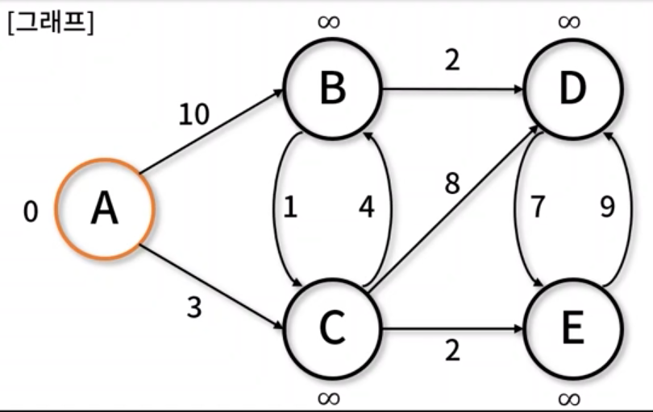

## 최단경로

- 가중 그래프에서 구성하는 간선 간 가중치 합이 최소가 되도록 최단 경로를 찾는 알고리즘
- 최단경로 유형
  - `Dijkstra 알고리즘`: 단일 최단경로, 최소비용 산출
  - `A* 알고리즘`: 휴라스틱 방법 사용한 탐색
  - `Bellman-Ford 알고리즘`: 음수 가중치 허용한 비용 산출
  - `Floyd-Warshall 알고리즘`: 동적 계획법 기반 고차원 기법

### Dijkstra 알고리즘

- 그래프에서 출발점과 도착점 사이의 최단 거리를 구하는 알고리즘
- 보통 단일 정점 간 최단 경로 산출 시 사용, 도로 교통 망이나 OSPF 등의 네트워크 라우팅 프로토콜 널리 이용
- 구현메서드

  - 정점/간선 추가: `ShortestPath.addVertex()`, `ShortestPath.addEdge()`
  - 다익스트라 알고리즘: `ShortestPath._extractMin()`, `ShortestPath.dijkstra()`

#### 의사코드

```javascript
function Dijkstra(Graph, source):
  create vertex set Q

  for each vertex v in Graph:   // 초기화
    dist[v] <- INFINITY         // 소스에서 v까지의 아직 모르는 길이
    add v to Q                  // 모든 노드에서 초기에 Q에 속해있다 (미방문 집합)

  dist[source] <- 0             // 소스에서 소스까지의 길이

  while Q is not empty:
    u <- vertex in Q with min dist[u]   // 최소 거리를 갖는 정점을 가장 먼저 선택

    remove u from Q

    for each neighbor v of u:           // v는 여전히 Q에 있다
      alt <- dist[u] + length(u, v)
      if alt < dist[v]:                 // v 까지의 더 짧은 경로를 찾았을 때
        dist[v] <- alt

  return dist[]
```

#### 준비물

- `ShortestPath()`: edge object 객체 저장을 위한 생성자
- `addVertex()`: 정점 추가 (간선 비용 표시를 위해 object 형태로 저장)
- `addEdge()`: 간선 추가
- `_extractMin()`: 최단 거리 노드 탐색

```javascript
// ShortestPath(): edge object 객체 저장을 위한 생성자
function ShortestPath() {
  this.edges = {};
}

// addVertex(): 정점 추가 (간선 비용 표시를 위해 object 형태로 저장)
ShortestPath.prototype.addVertex = function (vertex) {
  this.edges[vertex] = {};
};

// addEdge(): 간선 추가
ShortestPath.prototype.addEdge = function (srcVertex, dstVertex, weight) {
  this.edges[srcVertex][dstVertex] = weight;
};

// _extractMin(): 최단 거리 노드 탐색
ShortestPath.prototype._extractMin = function (queue, dist) {
  let minDistance = Number.POSITIVE_INFINITY;
  let minVertex = null;

  for (let vertex in queue) {
    if (dist[vertex] <= minDistance) {
      minDistance = dist[vertex];
      minVertex = vertex;
    }
  }

  return minVertex;
};
```

#### 다익스트라 구현

```javascript
// dijkstra(): 다익스트라 최단 경로 탐색
ShortestPath.prototype.dijkstra = function (start) {
  let queue = {};
  let dist = {};

  for (let vertex in this.edges) {
    dist[vertex] = Number.POSITIVE_INFINITY;
    queue[vertex] = this.edges[vertex];
  }

  console.log(queue); // edges
  console.log(dist); // { A: Infinity, B: Infinity, C: Infinity, D: Infinity, E: Infinity }

  dist[start] = 0; // 어디가 시작임을 알림

  // queue의 length가 0일때까지 반복
  while (Object.keys(queue).length != 0) {
    let u = this._extractMin(queue, dist); // 가장 dist가 작은 칭구를 소환 처음 시작시 dist가 0인 start부터 시작

    delete queue[u]; // 삭제

    // 소환된 u에서 갈 수 있는 이웃node들 구경함
    for (let neighbor in this.edges[u]) {
      let alt = dist[u] + this.edges[u][neighbor];
      if (alt < dist[neighbor]) dist[neighbor] = alt;
    } // u에서 이웃으로 이동할 시의 dist 최신화

    console.log(dist, u);
  }

  // 갈 수 없는 정보들은 Infinity로 나올거니깐 보기 안좋으니 삭제
  for (let vertex in this.edges)
    if (dist[vertex] === Number.POSITIVE_INFINITY) delete dist[vertex];

  return dist;
};

let path = new ShortestPath();
path.addVertex("A");
path.addVertex("B");
path.addVertex("C");
path.addVertex("D");
path.addVertex("E");

path.addEdge("A", "B", 10);
path.addEdge("A", "C", 3);
path.addEdge("B", "C", 1);
path.addEdge("B", "D", 2);
path.addEdge("C", "B", 4);
path.addEdge("C", "D", 8);
path.addEdge("C", "E", 2);
path.addEdge("D", "E", 7);
path.addEdge("E", "D", 9);

console.log(path);
/*
ShortestPath {
  edges: {
    A: { B: 10, C: 3 },
    B: { C: 1, D: 2 },
    C: { B: 4, D: 8, E: 2 },
    D: { E: 7 },
    E: { D: 9 }
  }
}
*/
console.log(path.dijkstra("A"));
/*
{
  A: { B: 10, C: 3 },
  B: { C: 1, D: 2 },
  C: { B: 4, D: 8, E: 2 },
  D: { E: 7 },
  E: { D: 9 }
} // queue
{ A: Infinity, B: Infinity, C: Infinity, D: Infinity, E: Infinity } // dist
{ A: 0, B: 10, C: 3, D: Infinity, E: Infinity } A // dist와 u
{ A: 0, B: 7, C: 3, D: 11, E: 5 } C
{ A: 0, B: 7, C: 3, D: 11, E: 5 } E
{ A: 0, B: 7, C: 3, D: 9, E: 5 } B
{ A: 0, B: 7, C: 3, D: 9, E: 5 } D
{ A: 0, B: 7, C: 3, D: 9, E: 5 } // 정답
*/
```



### Floyd-Warshall 알고리즘

- 동적 계획법을 활용해, 그래프에서 가능한 모든 정점 쌍에 대해 최단 거리를 구하는 알고리즘
- 음의 가중치가 있어도 사용 가능하며, 많은 수의 간선으로 이루어져 있는 밀집 그래프에 사용 적합
- 구현 메서드
  - 정점/간선 추가: `ShortestPath.addVertex()`, `ShortestPath.addEdge()`
  - 플로이드-워셜 알고리즘: `ShortestPath.floydWarshall()`

#### 의사코드

```javascript
function floydWarshall():
  let dist be a [V] x |V| array of
    minimum distances initialized to infinity

  for each edge (u, v)
    dist[u][v] <- w(u, v) // 변 (u, v)의 가중치

  for each vertex v
    dist[v][v] <- 0

  for k from 1 to |V|
    for i from 1 to |V|
      for j from 1 to |V|
        if dist[i][j] > dist[i][k] + dist[k][j]
          dist[i][j] <- dist[i][k] + dist[k][j]
        end if
```

#### Floyd-Warshall 구현

```javascript
// floydWarshall(): 플로이드-워셜 최단 경로 탐색
ShortestPath.prototype.floydWarshall = function () {
  let dist = {};

  for (let srcVertex in this.edges) {
    dist[srcVertex] = {};
    for (let dstVertex in this.edges) {
      if (srcVertex === dstVertex) dist[srcVertex][dstVertex] = 0;
      else dist[srcVertex][dstVertex] = Number.POSITIVE_INFINITY;
    }
  }

  for (let srcVertex in this.edges) {
    for (let dstVertex in this.edges[srcVertex]) {
      dist[srcVertex][dstVertex] = this.edges[srcVertex][dstVertex];
    }
  }

  for (let minVertex in this.edges) {
    for (let srcVertex in this.edges) {
      for (let dstVertex in this.edges) {
        dist[srcVertex][dstVertex] = Math.min(
          dist[srcVertex][dstVertex],
          dist[srcVertex][minVertex] + dist[minVertex][dstVertex]
        );
      }
    }
  }

  for (let srcVertex in this.edges) {
    for (let dstVertex in this.edges) {
      if (dist[srcVertex][dstVertex] === Number.POSITIVE_INFINITY)
        delete dist[srcVertex][dstVertex];
    }
  }

  return dist;
};

let path = new ShortestPath();
path.addVertex("A");
path.addVertex("B");
path.addVertex("C");
path.addVertex("D");
path.addVertex("E");

path.addEdge("A", "B", 10);
path.addEdge("A", "C", 3);
path.addEdge("B", "C", 1);
path.addEdge("B", "D", 2);
path.addEdge("C", "B", 4);
path.addEdge("C", "D", 8);
path.addEdge("C", "E", 2);
path.addEdge("D", "E", 7);
path.addEdge("E", "D", 9);

console.log(path);
console.log(path.floydWarshall());
```


