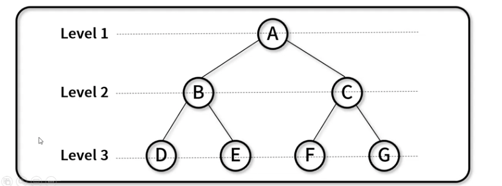
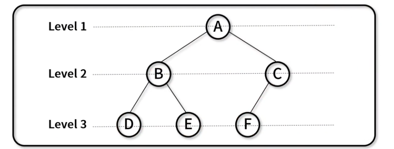
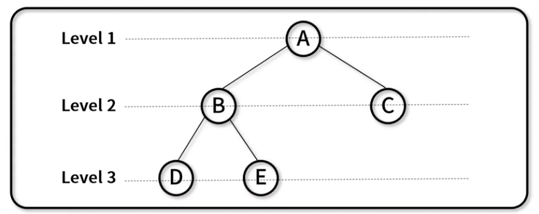
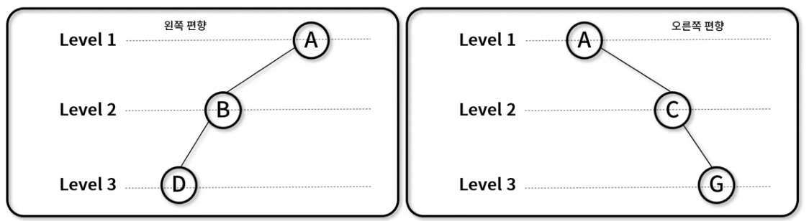
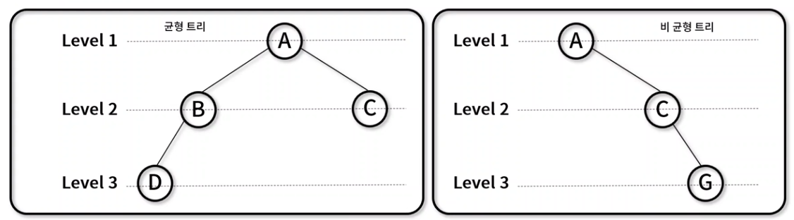

## 이진트리 (Binary Tree)

- 각각의 노드가 `최대 두개의 자식 노드`를 가지는 트리 자료 구조
- 활용 방식
  - 검색과 정렬: 이진 탐색 트리와 이진 힙 구현에 활용
  - 허프만 코딩: 연관 분기 구조 위한 데이터 표현에 활용
- 이진 트리의 종류
  - 포화 이진트리 (Perfect binary tree)
  - 완전 이진 트리 (Complete binary tree)
  - 정 이진 트리 (Full) binary tree)
  - 편향 이진 트리 (Skewed binary tree)
  - 균형 이진 트리 (Balanced binary tree)

### 포화 이진 트리

- 모든 레벨의 노드가 가득 채워져 있는 트리
- 특징
  - Leaf 노드를 제외한 모든 자식은 2개의 노드를 보유
  - 노드의 개수: n=2의h승 -1
- 트리 형태



### 완전 이진 트리

- 마지막 레벨 전까지 노드가 가득 채워져 있고, 마지막 레벨은 왼쪽부터 순차적으로 채워져 있는 트리
- 특징
  - 배열을 사용해 효율적인 표현이 가능
  - 노드의 개수: n<2의h승 -1
- 트리 형태



### 정 이진 트리

- 모든 노드가 0개 또는 2개의 자식 노드만 갖는 트리
- 특징
  - proper 또는 plane 이진 트리라 불림
  - 노드의 개수: n<= 2의h승 -1
- 트리 형태



### 편향 이진 트리

- 왼쪽 혹은 오른쪽으로 편향되게 치우쳐 있는 트리
- 특징
  - 각각의 높이에 하나의 노드만 존재
  - 노드의 개수:h



### 균형 이진 트리

- 삽입/삭제가 이루어 질 때, 왼쪽 서브 트리와 오른쪽 서브 트리의 높이 차를 1 이하로 맞추는 이진 탐색 트리
- 특징
  - 서브 트리 높이 차이가 항상 1 이하로 유지
  - 균형 트리 종류: AVL트리, Red-Black 트리, B트리, B+트리, B\*트리



### 이진 트리 순회 (Binary Tree Traversal)

- 각각의 노드가 최대 두개의 자식 노드를 가지는 트리 자료 구조를 순회하는 방법
- 구현 메서드
  - 노드 추가: `BinaryTree._insertNode()`, `BinaryTree.insert()`
  - 전위 순회: `BinaryTree._preOrderTraverseNode()`, `BinaryTree.preOrderTraverse()`
  - 중위 순회: `BinaryTree._inOrderTraverseNode()`, `BinaryTree.inOrderTraverse()`
  - 후위 순회: `BinaryTree._postOrderTraverseNode()`, `BinaryTree.postOrderTraverse()`
  - 층별 순회: `BinaryTree.levelOrderTraverseNode()`

### 이진트리 구현

- `Node()`: value와 left, right node 저장을 위한 생성자
- `BinaryTree()`: 시작 노드인 root를 저장하기 위한 생성자
- `_insertNode()`: 재귀로 트리를 순회하며 노드 추가 (내부 사용)
- `insert()`: 노드 추가

```javascript
// Node(): value와 left, right node 저장을 위한 생성자
function Node(value) {
  this.value = value;
  this.left = null;
  this.right = null;
}

// BinaryTree(): 시작 노드인 root를 저장하기 위한 생성자
function BinaryTree() {
  this.root = null;
}

// _insertNode(): 재귀로 트리를 순회하며 노드 추가 (내부 사용)
BinaryTree.prototype._insertNode = function (node, value) {
  // 현재값과 비교
  // 작으면 왼쪽, 크면 오른쪽
  // 왼쪽, 오른쪽에 left, right pointer 비어 있다면 추가할 노드를 연결
  // 비어있지 않다면 하위 노드에서 다시 비교하도록 넘겨줌

  if (node === null) {
    // 자리가 비어있다면
    node = new Node(value); // 해당 노드에 신규 노드를 생성
  } else if (value < node.value) {
    // 만약 넣고자하는 값이 현재에 있는 노드보다 값이 작다면
    node.left = this._insertNode(node.left, value); // node.left으로 이동 후 재귀
  } else if (value > node.value) {
    // 만약 넣고자하는 값이 현재에 있는 노드보다 값이 크다면
    node.right = this._insertNode(node.right, value); // node.right으로 이동 후 재귀
  }

  return node;
};

// insert(): 노드 추가
BinaryTree.prototype.insert = function (value) {
  this.root = this._insertNode(this.root, value);
};

let tree = new BinaryTree();

tree.insert("F"); // this.root가 null이니 root에 F값을 갖고 있는 노드 생성
tree.insert("B"); // root인 F에서 시작하여 값을 비교. F보다 작으니 왼쪽으로 이동. 값이 null이니 B값을 갖는 노드 생성
tree.insert("A"); // 위와 같이 값을 비교해가며 이동. F(root) -> B -> B보다 값이 작으니 왼쪽으로 이동 -> null -> node 생성
tree.insert("D"); // F(root) -> B -> B보다 값이 크니 오른쪽으로 이동 -> null -> node 생성
tree.insert("C"); // F(root) -> B -> B보다 크니 오른쪽 이동 -> D -> D보다는 작으니 왼쪽 이동 -> null -> 노드 생성
tree.insert("E");
tree.insert("G");
tree.insert("I");
tree.insert("H");

console.log(tree);
/*
BinaryTree {
  root: Node {
    value: 'F',
    left: Node { value: 'B', left: [Node], right: [Node] },
    right: Node { value: 'G', left: null, right: [Node] }
  }
}
*/
```

- 현재 생성한 이진트리 모습


### 전위 순회 구현

- `_preOrderTraverseNode()`: 재귀로 트리를 순회하며 전위 순회 (내부 사용)
- `preOrderTraverse()`: 전위 순회하며 노드 출력

```javascript
// _preOrderTraverseNode(): 재귀로 트리를 순회하며 전위 순회 (내부 사용)
BinaryTree.prototype._preOrderTraverseNode = function (node, callback) {
  if (node === null) {
    return;
  }

  callback(node); // print 사용시 현재 노드값 출력
  this._preOrderTraverseNode(node.left, callback); // 재귀로 왼쪽 방문
  this._preOrderTraverseNode(node.right, callback); // 재귀로 오른쪽 방문
};

// preOrderTraverse(): 전위 순회하며 노드 출력
BinaryTree.prototype.preOrderTraverse = function (callback) {
  this._preOrderTraverseNode(this.root, callback);
};

let tree = new BinaryTree();

tree.insert("F");
tree.insert("B");
tree.insert("A");
tree.insert("D");
tree.insert("C");
tree.insert("E");
tree.insert("G");
tree.insert("I");
tree.insert("H");

function printNode(node) {
  process.stdout.write(`${node.value} -> `);
}

console.log("********** Pre-Order **********");
tree.preOrderTraverse(printNode);
console.log("end");
/*
********** Pre-Order **********
F -> B -> A -> D -> C -> E -> G -> I -> H -> end
*/
```


- F -> B -> A -> D -> C -> E -> G -> I -> H -> end
- 현재 위치 출력 후 재귀 함수로 우선 왼쪽으로 한단계 진입
- 만약에 왼쪽 child의 값이 null이면 재귀 함수로 오른쪽으로 한단계 진입
- 오른쪽도 null이면 재귀의 한단계가 끝나 그 전 level로 올라감

### 중위 순회 구현

- `_inOrderTraverseNode()`: 재귀로 트리를 순회하며 중위 순회 (내부 사용)
- `inOrderTraverse()`: 중위 순회하며 노드 출력

```javascript
// _inOrderTraverseNode(): 재귀로 트리를 순회하며 중위 순회 (내부 사용)
BinaryTree.prototype._inOrderTraverseNode = function (node, callback) {
  if (node === null) {
    return;
  }

  this._inOrderTraverseNode(node.left, callback);
  callback(node);
  this._inOrderTraverseNode(node.right, callback);
};

// inOrderTraverse(): 중위 순회하며 노드 출력
BinaryTree.prototype.inOrderTraverse = function (callback) {
  this._inOrderTraverseNode(this.root, callback);
};

let tree = new BinaryTree();

tree.insert("F");
tree.insert("B");
tree.insert("A");
tree.insert("D");
tree.insert("C");
tree.insert("E");
tree.insert("G");
tree.insert("I");
tree.insert("H");

function printNode(node) {
  process.stdout.write(`${node.value} -> `);
}

console.log("********** In-Order **********");
tree.inOrderTraverse(printNode);
console.log("end");

/*
********** In-Order **********
A -> B -> C -> D -> E -> F -> G -> H -> I -> end
*/
```


- A -> B -> C -> D -> E -> F -> G -> H -> I -> end
- 왼쪽으로 진입 후 만약 왼쪽 노드값이 null이면 현재 노드값 출력
- F -> 왼쪽이동(B) -> 왼쪽이동(A) -> 왼쪽노드 null -> `현재 위치 출력(A)` -> 오른쪽 노드(null) -> 재귀end -> 재귀 전단계 -> `현재위치 출력(B)` -> 오른쪽이동(D) -> 왼쪽이동(C) -> 왼쪽노드(null) -> `현재위치 출력(C)` -> 오른쪽 노드(null) -> 재귀end -> 재귀 전단계 -> `현재위치 출력(D)` -> 오른쪽이동(E) -> 왼쪽노드 null -> `현재위치 출력(E)` -> 오른쪽 노드 null -> 재귀 end -> 재귀 전단계 -> 재귀 end -> 재귀 전단계 -> 재귀end -> 재귀 전단계 -> `현재 위치 출력(F)` -> 오른쪽 이동(G) -> 왼쪽노드 null -> `현재 위치 출력(G)` -> 오른쪽 이동(I) -> 왼쪽이동(H) -> 왼쪽 노드 null -> `현재 위치 출력(H)` -> 오른쪽 노드 null -> 재귀end -> 재귀 전단계 -> `현재 위치 출력(I)` -> 오른쪽 노드 null -> 재귀end -> 재귀 전단계 -> 재귀end -> 재귀 전단계 -> 재귀 end(함수 끝)

### 후위 순회 구현

- `_postOrderTraverseNode()`: 재귀로 트리를 순회하며 후위 순회 (내부 사용)
- `postOrderTraverse()`: 후위 순회하며 노드 출력

```javascript
// _postOrderTraverseNode(): 재귀로 트리를 순회하며 후위 순회 (내부 사용)
BinaryTree.prototype._postOrderTraverseNode = function (node, callback) {
  if (node === null) {
    return;
  }

  this._postOrderTraverseNode(node.left, callback);
  this._postOrderTraverseNode(node.right, callback);
  callback(node);
};

// postOrderTraverse(): 후위 순회하며 노드 출력
BinaryTree.prototype.postOrderTraverse = function (callback) {
  this._postOrderTraverseNode(this.root, callback);
};

let tree = new BinaryTree();

tree.insert("F");
tree.insert("B");
tree.insert("A");
tree.insert("D");
tree.insert("C");
tree.insert("E");
tree.insert("G");
tree.insert("I");
tree.insert("H");

function printNode(node) {
  process.stdout.write(`${node.value} -> `);
}

console.log("********** Post-Order **********");
tree.postOrderTraverse(printNode);
console.log("end");
/*
********** Post-Order **********
A -> C -> E -> D -> B -> H -> I -> G -> F -> end
*/
```


- A -> C -> E -> D -> B -> H -> I -> G -> F -> end
- 중위 순회와 매우 비슷한 원리

### 층별 순회

- `Queue` 객체 사용
- `levelOrderTraverse()`: 층별 순회하며 노드 출력

```javascript
/* Queue 객체 추가 */
function Queue(array) {
  this.array = array ? array : [];
}

Queue.prototype.isEmpty = function () {
  return this.array.length === 0;
};

Queue.prototype.enqueue = function (element) {
  return this.array.push(element);
};

Queue.prototype.dequeue = function () {
  return this.array.shift();
};

// levelOrderTraverse(): 층별 순회하며 노드 출력
BinaryTree.prototype.levelOrderTraverse = function (callback) {
  let q = new Queue();
  let node;
  q.enqueue(this.root);

  while (!q.isEmpty()) {
    node = q.dequeue();
    callback(node);
    if (node.left !== null) q.enqueue(node.left);
    if (node.right !== null) q.enqueue(node.right);
  }
};

let tree = new BinaryTree();

tree.insert("F");
tree.insert("B");
tree.insert("A");
tree.insert("D");
tree.insert("C");
tree.insert("E");
tree.insert("G");
tree.insert("I");
tree.insert("H");

function printNode(node) {
  process.stdout.write(`${node.value} -> `);
}

console.log("********** Level-Order **********");
tree.levelOrderTraverse(printNode);
console.log("end");
/*
********** Level-Order **********
F -> B -> G -> A -> D -> I -> C -> E -> H -> end
*/
```


- F -> B -> G -> A -> D -> I -> C -> E -> H -> end
- root를 큐에 enqueue로 시작함 `[F]`
- `큐 dequeue 후 출력(F)` -> dequeue한 노드의 왼쪽노드 큐에 push -> dequeue한 노드의 오른쪽노드 큐에 enqueue `[B, G]`
- `큐 dequeue 후 출력(B)` -> dequeue한 노드의 왼쪽노드 큐에 push -> dequeue한 노드의 오른쪽노드 큐에 enqueue `[G, A, D]`
- `큐 dequeue 후 출력(G)` -> dequeue한 노드의 왼쪽노드 큐에 push -> dequeue한 노드의 오른쪽노드 큐에 enqueue `[A, D, I]`
- 이런 식으로 계속 반복...
