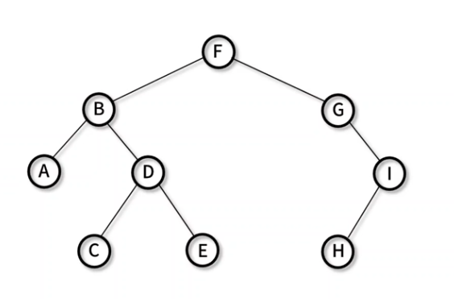

## 이진 탐색 트리 (Binary Search Tree)

- 현재 노드를 기준으로 `왼쪽에는 작은 값`, `오른쪽은 큰 값으로 정렬`해 놓는 이진 트리 기반 자료구조
- 구현 메서드
  - 노드 추가: `BinarySearchTree._insertNode()`, `BinarySearchTree.insert()`
  - 노드 탐색(최댓값): `BinarySearchTree._maxNode()`, `BinarySearchTree.max()`
  - 노드 탐색(최솟값): `BinarySearchTree._minNode()`, `BinarySearchTree.min()`
  - 노드 탐색(특정값): `BinarySearchTree._searchNode()`, `BinarySearchTree.search()`
  - 노드 삭제: `BinarySearchTree._findMinNode()`, `BinarySearchTree._removeNode()`, `BinarySearchTree.remove()`

### 이진 트리 구현

- 전에 구현한 이진트리와 같음

- `Node()`: value와 left, right node 저장을 위한 생성자
- `BinarySearchTree()`: 시작 노드인 root를 저장하기 위한 생성자
- `_insertNode()`: 재귀로 트리를 순회하며 노드 추가 (내부 사용)
- `insert()`: 노드 추가
- `_inOrderTraverseNode()`: 재귀로 트리를 순회하며 중위 순회 (내부 사용)
- `inOrderTraverse()`: 중위 순회하며 노드 출력

```javascript
// Node(): value와 left, right node 저장을 위한 생성자
function Node(value) {
  this.value = value;
  this.left = null;
  this.right = null;
}

// BinarySearchTree(): 시작 노드인 root를 저장하기 위한 생성자
function BinarySearchTree() {
  this.root = null;
}

// _insertNode(): 재귀로 트리를 순회하며 노드 추가 (내부 사용)
BinarySearchTree.prototype._insertNode = function (node, value) {
  if (node === null) {
    node = new Node(value);
  } else if (value < node.value) {
    node.left = this._insertNode(node.left, value);
  } else if (value > node.value) {
    node.right = this._insertNode(node.right, value);
  }

  return node;
};

// insert(): 노드 추가
BinarySearchTree.prototype.insert = function (value) {
  this.root = this._insertNode(this.root, value);
};

// _inOrderTraverseNode(): 재귀로 트리를 순회하며 중위 순회 (내부 사용)
BinarySearchTree.prototype._inOrderTraverseNode = function (node, callback) {
  if (node === null) {
    return;
  }

  this._inOrderTraverseNode(node.left, callback);
  callback(node);
  this._inOrderTraverseNode(node.right, callback);
};

// inOrderTraverse(): 중위 순회하며 노드 출력
BinarySearchTree.prototype.inOrderTraverse = function (callback) {
  this._inOrderTraverseNode(this.root, callback);
  console.log("end");
};

let tree = new BinarySearchTree();

tree.insert("F");
tree.insert("B");
tree.insert("A");
tree.insert("D");
tree.insert("C");
tree.insert("E");
tree.insert("G");
tree.insert("I");
tree.insert("H");

function printNode(node) {
  process.stdout.write(`${node.value} -> `);
}

tree.inOrderTraverse(printNode);
// A -> B -> C -> D -> E -> F -> G -> H -> I -> end
```

- 구현한 트리



### 노드탐색 (최솟값, 최댓값)

- `_minNode()`: 반복문으로 트리를 순회하며 최솟값 노드 탐색
- `_maxNode()`: 반복문으로 트리를 순회하며 최대값 노드 탐색
- `min()`: 최솟값 노드 탐색
- `max()`: 최댓값 노드 탐색

```javascript
// _minNode(): 반복문으로 트리를 순회하며 최솟값 노드 탐색
BinarySearchTree.prototype._minNode = function (node) {
  if (node === null) {
    return null;
  }

  while (node && node.left !== null) {
    node = node.left; // 최소값의 노드는 가장 왼쪽에 있으니 왼쪽의 끝까지 탐색
  }

  return node.value; // 가장 왼쪽의 노드(최소값)을 찾으면 반환
};

// _maxNode(): 반복문으로 트리를 순회하며 최대값 노드 탐색
BinarySearchTree.prototype._maxNode = function (node) {
  if (node === null) {
    return null;
  }

  while (node && node.right !== null) {
    node = node.right; // 최대값의 노드는 가장 오른쪽에 있으니 오른쪽의 끝까지 탐색
  }

  return node.value; // 가장 오른쪽의 노드(최대값)을 찾으면 반환
};

// min(): 최솟값 노드 탐색
BinarySearchTree.prototype.min = function () {
  return this._minNode(this.root);
};

// max(): 최댓값 노드 탐색
BinarySearchTree.prototype.max = function () {
  return this._maxNode(this.root);
};

let tree = new BinarySearchTree();

tree.insert("F");
tree.insert("B");
tree.insert("A");
tree.insert("D");
tree.insert("C");
tree.insert("E");
tree.insert("G");
tree.insert("I");
tree.insert("H");

function printNode(node) {
  process.stdout.write(`${node.value} -> `);
}

console.log(tree.min()); // A
console.log(tree.max()); // I
```

### 노드 탐색(특정값)

- `_searchNode()`: 재귀로 트리를 순회하며 값을 만족하는 노드 탐색
- `search()`: value 노드 탐색

```javascript
// _searchNode(): 재귀로 트리를 순회하며 값을 만족하는 노드 탐색
BinarySearchTree.prototype._searchNode = function (node, value) {
  // 모든 값들을 순회하여 원하는 값을 찾음
  // 순회 방식은 그 전과 특별한 점이 없음
  if (node === null) {
    return false;
  }

  if (node.value === value) {
    return true; // 찾으면 true 반환
  } else if (node.value > value) {
    return this._searchNode(node.left, value);
  } else if (node.value < value) {
    return this._searchNode(node.right, value);
  }
};

// search(): value 노드 탐색
BinarySearchTree.prototype.search = function (value) {
  return this._searchNode(this.root, value);
};

let tree = new BinarySearchTree();

tree.insert("F");
tree.insert("B");
tree.insert("A");
tree.insert("D");
tree.insert("C");
tree.insert("E");
tree.insert("G");
tree.insert("I");
tree.insert("H");

function printNode(node) {
  process.stdout.write(`${node.value} -> `);
}

console.log(tree.search("J") ? "Found J" : "Not found J"); // Not found J
console.log(tree.search("I") ? "Found I" : "Not found I"); // Found I
```

## 노드 삭제

- `_findMimNode()`: 반복문으로 트리를 순회하며 최솟값을 보유한 노드 탐색/반환
- `_removeNode()`: 재귀로 트리를 순회하며 값을 만족하는 노드를 찾고 삭제
- `remove()`: 노트 삭제

- 3가지 케이스로 나눠서 삭제
  1. 자식 노드가 없는 경우
  2. 자식 노드가 하나인 경우
  3. 자식 노드가 두개인 경우

```javascript
// _findMimNode(): 반복문으로 트리를 순회하며 최솟값을 보유한 노드 탐색/반환
BinarySearchTree.prototype._findMinNode = function (node) {
  while (node && node.left !== null) {
    // 가장 작은 값은 tree의 가장 왼쪽에 위치하기에 왼쪽 끝까지 이동
    node = node.left;
  }

  return node;
};

// _removeNode(): 재귀로 트리를 순회하며 값을 만족하는 노드를 찾고 삭제
BinarySearchTree.prototype._removeNode = function (node, value) {
  if (node === null) {
    return null;
  }

  // 삭제해야할 값을 찾은 경우
  if (node.value === value) {
    // case 1: 0 child node (leaf node)
    if (node.left === null && node.right === null) {
      node = null;
    }
    // case 2: 1 child node
    else if (node.left === null) {
      node = node.right; // 오른쪽 자식 노드가 있는 경우 기존 노드를 오른쪽 자식 노드로 대체
    } else if (node.right === null) {
      node = node.left; // 왼쪽 자식 노드가 있는 경우 기존 노드를 왼쪽 자식 노드로 대체
    }

    // case 3: 2 child node
    // 삭제할 노드의 오른쪽의 subtree에서 가장 작은 값을 찾아서 삭제할 노드에 대체
    else {
      let aux = this._findMinNode(node.right); // 삭제할 노드의 오른쪽의 subtree의 가장 작은 값을 찾음
      node.value = aux.value; // 삭제할 노드의 값과 subtree의 가장 작은 값과 대체
      node.right = this._removeNode(node.right, aux.value); // subtree의 가장 작은 값을 지닌 노드가 존재하여 중복이 되기에 삭제
    }

    // 삭제할 값을 못 찾은 경우 순회
  } else if (node.value > value) {
    node.left = this._removeNode(node.left, value);
  } else if (node.value < value) {
    node.right = this._removeNode(node.right, value);
  }

  return node;
};

// remove(): 노트 삭제
BinarySearchTree.prototype.remove = function (value) {
  this.root = this._removeNode(this.root, value);
};

let tree = new BinarySearchTree();

tree.insert("F");
tree.insert("B");
tree.insert("A");
tree.insert("D");
tree.insert("C");
tree.insert("E");
tree.insert("G");
tree.insert("I");
tree.insert("H");

function printNode(node) {
  process.stdout.write(`${node.value} -> `);
}

tree.inOrderTraverse(printNode); // A -> B -> C -> D -> E -> F -> G -> H -> I -> end
tree.remove("H");
tree.inOrderTraverse(printNode); // A -> B -> C -> D -> E -> F -> G -> I -> end
tree.remove("D");
tree.inOrderTraverse(printNode); // A -> B -> C -> E -> F -> G -> I -> end
tree.remove("F");
tree.inOrderTraverse(printNode); // A -> B -> C -> E -> G -> I -> end

console.log(tree.root);
/*
Node {
  value: 'G',
  left: Node {
    value: 'B',
    left: Node { value: 'A', left: null, right: null },
    right: Node { value: 'E', left: [Node], right: null }
  },
  right: Node { value: 'I', left: null, right: null }
}
*/
```
