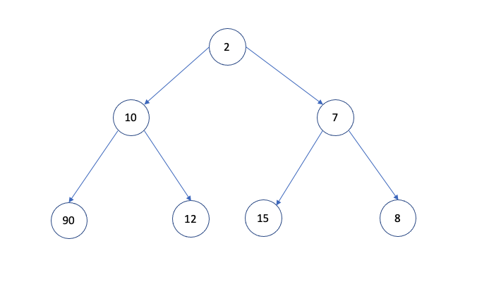
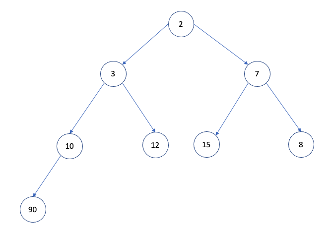
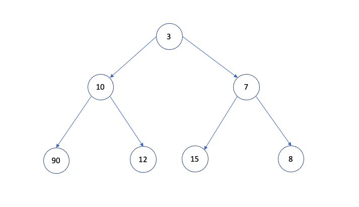

## 힙(Heap)

- 최댓값 혹은 최솟값을 빠르게 찾기 위해 완전 이진트리 형태로 연산을 수행하는 자료구조
- 힙 대표 속성
  - 정렬: 각 노드의 값은 자식 노드가 가진 값보다 작거나 혹은 큰 순서대로 정렬
  - 형태: 트리의 형태는 `완전이진트리(complete binary tree) 모양`
- 힙 종류
  - 최소 힙(Min Heap): 부모 노드의 값이 자식 노드의 값보다, 작거나 같은 완전 이진 트리
  - 최대 힙(Max Heap): 부모 노드의 값이 자식 노드의 값보다, 크거나 같은 완전 이진 트리
- 힙 구현
  - 완전 이진트리 성질을 만족하기 때문에 1차원 배열로 표현 가능
  - 현재 노드: N, 부모 노드: (N-1)/2, 왼쪽 자식 노드: (N*2)+1, 오른쪽 자식 노드: (N*2)+2
- 구현 메서드
  - 노드 위치 계산: `Heap.parentIndex()`, `Heap.leftChildIndex()`, `Heap.rightChildIndex()`
  - 노드 값 확인: `Heap.parent()`, `Heap.leftChild()`, `Heap.rightChild()`
  - 노드 추가/삭제(추출): `Heap.insert()`, `Heap.bubbleUp()`, `Heap.extract()`, `Heap.bubbleDown()`

### 힙 구현(1)

- `Heap()`: 배열 내 요소를 저장하기 위한 생성자
- `swap()`: 배열 내 두 요소 위치를 변경
- `parentIndex()`: 부모 노드의 위치 반환
- `leftChildIndex()`: 왼쪽 자식 노드의 위치 반환
- `rightChildIndex()`: 오른쪽 자식 노드의 위치 반환
- `parent()`: 부모 노드의 요소 값 반환
- `leftChild()`: 왼쪽 자식 노드의 요소 값 반환
- `rightChild()`: 오른쪽 자식 노드의 요소 값 반환
- `peek()`: 현재 정렬된 최소/최대 요소값 반환
- `size()`: 현재 배열 내 크기 반환

```javascript
/* 최소힙 (MinHeap) */
// Heap(): 배열 내 요소를 저장하기 위한 생성자
function Heap() {
  this.items = [];
}

// swap(): 배열 내 두 요소 위치를 변경
Heap.prototype.swap = function (index1, index2) {
  let tmp = this.items[index1];
  this.items[index1] = this.items[index2];
  this.items[index2] = tmp;
};

// parentIndex(): 부모 노드의 위치 반환
Heap.prototype.parentIndex = function (index) {
  return Math.floor((index - 1) / 2);
};

// leftChildIndex(): 왼쪽 자식 노드의 위치 반환
Heap.prototype.leftChildIndex = function (index) {
  return index * 2 + 1;
};

// rightChildIndex(): 오른쪽 자식 노드의 위치 반환
Heap.prototype.rightChildIndex = function (index) {
  return index * 2 + 2;
};

// parent(): 부모 노드의 요소 값 반환
Heap.prototype.parent = function (index) {
  return this.items[this.parentIndex(index)];
};

// leftChild(): 왼쪽 자식 노드의 요소 값 반환
Heap.prototype.leftChild = function (index) {
  return this.items[this.leftChildIndex(index)];
};

// rightChild(): 오른쪽 자식 노드의 요소 값 반환
Heap.prototype.rightChild = function (index) {
  return this.items[this.rightChildIndex(index)];
};

// peek(): 현재 정렬된 최소/최대 요소값 반환
Heap.prototype.peek = function () {
  return this.items[0];
};

// size(): 현재 배열 내 크기 반환
Heap.prototype.size = function () {
  return this.items.length;
};
```

### 최소힙 추가 구현(2)

- 노드 추가하는 원리

  1. 가장 마지막 인덱스에 추가
  2. 부모의 값과 신규 노드 값을 비교하며 서로 바꿔야할 시에 swap
  3. 새로운 위치에서의 부모값과 비교를 하며 자신의 자리를 찾아감

- `insert()`: 신규 노드 추가
- `bubbleUp()`: 추가된 노드 위치 정렬

```javascript
// insert(): 신규 노드 추가
Heap.prototype.insert = function (item) {
  this.items[this.size()] = item; // 가장 마지막 인덱스에 추가
  this.bubbleUp(); // 노드 위치 정렬
};

// bubbleUp(): 추가된 노드 위치 정렬
Heap.prototype.bubbleUp = function () {
  let index = this.size() - 1; // 현재 인덱스

  // 부모 존재하는지 체크 && 부모의 값이 나보다 큰지 확인
  while (this.parent(index) && this.parent(index) > this.items[index]) {
    this.swap(this.parentIndex(index), index); // 나와 부모 값 swap
    index = this.parentIndex(index); // 인덱스도 서로 swap
  }
};

let minHeap = new Heap();

minHeap.insert(90);
minHeap.insert(15);
minHeap.insert(10);
minHeap.insert(7);
minHeap.insert(12);
minHeap.insert(2);
minHeap.insert(8);
console.log(minHeap);
/*
Heap { items: [
     2, 10, 7, 90,
    12, 15, 8
  ] }
*/

minHeap.insert(3);
console.log(minHeap);
/*
Heap { items: [
     2,  3, 7, 10,
    12, 15, 8, 90
  ] }
*/
```

- 변경 전



- 변경 후

가장 마지막 인덱스에 3을 추가 후 새롭게 정렬한 결과



- 신규노드 3과 부모노드인 90과 값을 비교 후 swap -> 3과 부모노드 10과 비교 후 swap -> 3과 부모노드 2 비교 후 정렬 종료

### 최소힙 삭제 구현(3)

- 힙 삭제 원리

  1. root 노드를 삭제
  2. 삭제한 root 노드와 가장 마지막 인덱스의 노드를 swap
  3. child값과 비교하며 힙 재정렬

- `extract()`: root 노드 반환 및 삭제
- `bubbleDown()`: 대체된 root 노드 위치를 기준으로 정렬

```javascript
// extract(): root 노드 반환 및 삭제
Heap.prototype.extract = function () {
  let item = this.items[0];
  this.items[0] = this.items[this.size() - 1]; // root과 가장 마지막 인덱스의 값과 swap
  this.items.pop(); // root 삭제
  this.bubbleDown(); // 재정렬
  return item; // 삭제한 root값 반환
};

// bubbleDown(): 대체된 root 노드 위치를 기준으로 정렬
Heap.prototype.bubbleDown = function () {
  let index = 0; // 현재 인덱스

  // leftChild가 존재하고 && (왼쪽 자식이 나보다 작거나 || 오른쪽 자식이 나보다 작을 때)
  // leftChild가 index상 우선이기에 leftChild가 없으면 child 자체가 없는거임
  // 두 자식이 나보다 값이 크면 만족하는 자리를 때문에 종료
  while (
    this.leftChild(index) &&
    (this.leftChild(index) < this.items[index] ||
      this.rightChild(index) < this.items[index])
  ) {
    let childIndex = this.leftChildIndex(index); // 우선 childIndex를 leftChildIndex로 함
    if (
      // 만약 rightChild가 존재하고 && rightChild가 leftChild보다 작다면
      this.rightChild(index) &&
      this.rightChild(index) < this.items[childIndex]
    ) {
      // rightChild로 바꿈
      childIndex = this.rightChildIndex(index);
    }

    this.swap(childIndex, index); // 조건에 맞는 child와 swap
    index = childIndex; // index도 swap
  }
};

let minHeap = new Heap();

minHeap.insert(90);
minHeap.insert(15);
minHeap.insert(10);
minHeap.insert(7);
minHeap.insert(12);
minHeap.insert(2);
minHeap.insert(8);
minHeap.insert(3);
console.log(minHeap);
/*
Heap { items: [
     2,  3, 7, 10,
    12, 15, 8, 90
  ] }
*/

console.log(minHeap.extract()); // 2
console.log(minHeap);
/*
Heap { items: [
     3, 10, 7, 90,
    12, 15, 8
  ] }
*/
console.log(minHeap.extract()); // 3
console.log(minHeap.extract()); // 7
console.log(minHeap.extract()); // 8
console.log(minHeap.extract()); // 10
console.log(minHeap.extract()); // 12
console.log(minHeap.extract()); // 15
console.log(minHeap.extract()); // 90
```

- 변경 전


- 변경 후



root 삭제 후 -> 마지막 인덱스인 90이 root를 대체 -> 정렬하며 현재 자리 잡음

### 최대힙 구현

- `bubbleUp()`과 `bubbleDown()` 일부분만 바꾸면 됨
- 나머지는 똑같음

```javascript
// bubbleUp(): 추가된 노드 위치 정렬
Heap.prototype.bubbleUp = function () {
  let index = this.size() - 1;

  // 비교하는 부호만 바꿈
  while (this.parent(index) && this.parent(index) < this.items[index]) {
    this.swap(this.parentIndex(index), index);
    index = this.parentIndex(index);
  }
};

// bubbleDown(): 대체된 root 노드 위치를 기준으로 정렬
Heap.prototype.bubbleDown = function () {
  let index = 0;

  // 비교하는 부호만 바꿈
  while (
    this.leftChild(index) &&
    (this.leftChild(index) > this.items[index] ||
      this.rightChild(index) > this.items[index])
  ) {
    let childIndex = this.leftChildIndex(index);
    if (
      this.rightChild(index) &&
      // 비교하는 부호만 바꿈
      this.rightChild(index) > this.items[childIndex]
    ) {
      childIndex = this.rightChildIndex(index);
    }

    this.swap(childIndex, index);
    index = childIndex;
  }
};

let maxHeap = new Heap();

maxHeap.insert(90);
maxHeap.insert(15);
maxHeap.insert(10);
maxHeap.insert(7);
maxHeap.insert(12);
maxHeap.insert(2);
maxHeap.insert(8);
maxHeap.insert(3);
console.log(maxHeap);
/*
Heap { items: [
    90, 15, 10, 7,
    12,  2,  8, 3
  ] }
*/

console.log(maxHeap.extract()); // 90
console.log(maxHeap);
/*
Heap { items: [
    15, 12, 10, 7,
     3,  2,  8
  ] }
*/
console.log(maxHeap.extract()); // 15
console.log(maxHeap.extract()); // 12
console.log(maxHeap.extract()); // 10
console.log(maxHeap.extract()); // 8
console.log(maxHeap.extract()); // 7
console.log(maxHeap.extract()); // 3
console.log(maxHeap.extract()); // 2
```
