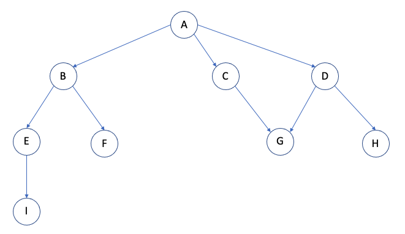

## DFS(Depth First Search)

- 트리나 그래프 등에서 하나의 노드를 최대한 깊게 들어가면서 해를 찾는 탐색 기법
- 장/단점
  - 장점: 인접한 후보 노드만 기억하면 되므로 적은 기억공간 소요, 노드가 깊은 단계에 있을 경우 빠르게 정답 산출
  - 단점: 선택한 경로가 답이 아닐 경우 불필요한 탐색 가능, 최단 경로를 구할 시 찾은 해가 정답이 아닐 경우 발생
- 구현 메서드
  - 재귀를 이용한 탐색: `Graph._dfsRecursiveVisit()`
  - 스택을 이용한 탐색: `Graph.dfsLoopVisit()`

### 그래프 구현

- DFS에 필요한 그래프 자료구조 구현
- Graph()에 visted object를 추가함
- addVertex에 정점 추가시 visted에 키값을 정점 & 해당값으로 false 주도록 함

- `Graph()`: edge object 객체 저장을 위한 생성자
- `addVertex()`: 정점(Vertex) 추가
- `addEdge()`: 간선(Edge) 추가
- `print()`: 현재 Graph 연결 상태 출력

```javascript
function Graph() {
  this.edge = {};
  this.visited = {}; // visited를 추가함으로 순회할 때 방문 유무를 체크할 수 있음
}

Graph.prototype.addVertex = function (v) {
  this.edge[v] = [];
  this.visited[v] = false; // 기본적으로 정점: false로 설정
};

Graph.prototype.addEdge = function (v1, v2) {
  this.edge[v1].push(v2);
};

Graph.prototype.print = function () {
  for (let vertex in this.edge) {
    let neighbors = this.edge[vertex];
    if (neighbors.length === 0) continue;

    process.stdout.write(`${vertex} -> `);
    for (let j = 0; j < neighbors.length; j++) {
      process.stdout.write(`${neighbors[j]} `);
    }
    console.log("");
  }
};
```

### 재귀를 이용한 DFS 탐색

- `dfs()`: DFS 탐색
- `_dfsRecursiveVisit()`: 재귀를 이용한 DFS 탐색

```javascript
// dfs(): DFS 탐색
Graph.prototype.dfs = function (startVertex) {
  this._dfsRecursiveVisit(startVertex);
};

// _dfsRecursiveVisit(): 재귀를 이용한 DFS 탐색
Graph.prototype._dfsRecursiveVisit = function (vertex) {
  // 1. 종료 조건
  if (this.visited[vertex]) {
    // visited[vertex]가 true면 이미 해당 노드를 방문했으니 실행하지 않음
    return;
  }

  // 2. 재귀 호출을 하면서 수행해야할 코드
  this.visited[vertex] = true;
  console.log(`visit "${vertex}"`);

  let neighbors = this.edge[vertex];
  for (let i = 0; i < neighbors.length; i++) {
    this._dfsRecursiveVisit(neighbors[i]); // 근접하는 노드들을 방문
  }
};

let graph = new Graph();
let vertices = ["A", "B", "C", "D", "E", "F", "G", "H", "I"];

for (let i = 0; i < vertices.length; i++) {
  graph.addVertex(vertices[i]);
}

graph.addEdge("A", "B");
graph.addEdge("A", "C");
graph.addEdge("A", "D");
graph.addEdge("C", "G");
graph.addEdge("D", "G");
graph.addEdge("D", "H");
graph.addEdge("B", "E");
graph.addEdge("B", "F");
graph.addEdge("E", "I");
graph.print();
console.log("");
/*
A -> B C D 
B -> E F 
C -> G 
D -> G H 
E -> I 
*/

graph.dfs("A");
/*
visit "A"
visit "B"
visit "E"
visit "I"
visit "F"
visit "C"
visit "G"
visit "D"
visit "H"
*/
```



- A -> B -> E -> I -> F -> C -> G -> D -> H

### 스택을 이용한 DFS 탐색

#### 스택 구현

- 스택을 활용하기 위한 구현

```javascript
// Stack(): 생성자 함수
function Stack(array) {
  this.array = array ? array : [];
}

// getBuffer(): 객체 내 데이터 셋 반환
Stack.prototype.getBuffer = function () {
  return this.array.slice();
};

// isEmpty(): 객체 내 데이터 O/X
Stack.prototype.isEmpty = function () {
  return this.array.length === 0;
};

// push(): 데이터 추가
Stack.prototype.push = function (element) {
  return this.array.push(element);
};

// pop(): 데이터 삭제
Stack.prototype.pop = function () {
  return this.array.pop();
};

// peek(): 가장 끝 데이터 반환
Stack.prototype.peek = function () {
  return this.array[this.array.length - 1];
};

// size(): 스택 내 데이터 개수 확인
Stack.prototype.size = function () {
  return this.array.length;
};

// indexOf(); 매개변수로 넘어온 element 위치 확인
Stack.prototype.indexOf = function (element, position = 0) {
  // return this.array.indexOf(element, position);
  for (let i = position; i < this.array.length; i++) {
    if (element === this.array[i]) return i;
  }
  return -1;
};

// includes(): 데이터 존재 여부 확인
Stack.prototype.includes = function (element, position = 0) {
  // return this.array.includes(element);
  for (let i = position; i < this.array.length; i++) {
    if (element === this.array[i]) return true;
  }
  return false;
};

export { Stack };
```

#### 스택과 DFS 탐색

- `dfs()`: DFS 탐색
- `_dfsLoopVisit()`: 스택을 이용한 DFS 탐색

```javascript
import { Stack } from "./stack.mjs";

// dfs(): DFS 탐색
Graph.prototype.dfs = function (startVertex) {
  // this._dfsRecursiveVisit(startVertex);
  this._dfsLoopVisit(startVertex);
};

// _dfsLoopVisit(): 스택을 이용한 DFS 탐색
Graph.prototype._dfsLoopVisit = function (vertex) {
  let stack = new Stack();
  stack.push(vertex); // 어디서 시작하는지 지정

  while (!stack.isEmpty()) {
    let vertex = stack.pop(); // 스택에서 pop
    if (this.visited[vertex]) {
      continue; // 만약에 기존에 방문했었다면 continue로 넘어감
    }

    this.visited[vertex] = true; // 방문체크
    console.log(`visit "${vertex}"`);

    let neighbors = this.edge[vertex];
    for (let i = neighbors.length - 1; i >= 0; i--) {
      stack.push(neighbors[i]); // 오른쪽 순으로 stack에 push
    }
  }
};

let graph = new Graph();
let vertices = ["A", "B", "C", "D", "E", "F", "G", "H", "I"];

for (let i = 0; i < vertices.length; i++) {
  graph.addVertex(vertices[i]);
}

graph.addEdge("A", "B");
graph.addEdge("A", "C");
graph.addEdge("A", "D");
graph.addEdge("C", "G");
graph.addEdge("D", "G");
graph.addEdge("D", "H");
graph.addEdge("B", "E");
graph.addEdge("B", "F");
graph.addEdge("E", "I");
graph.print();
console.log("");
/*
A -> B C D 
B -> E F 
C -> G 
D -> G H 
E -> I 
*/

graph.dfs("A");
/*
visit "A"
visit "B"
visit "E"
visit "I"
visit "F"
visit "C"
visit "G"
visit "D"
visit "H"
*/
```


- A -> B -> E -> I -> F -> C -> G -> D -> H

1. 시작하는 노드(A)를 스택에 push 후 while문 시작. `스택: [A]`
2. 스택에서 pop(A) 후 프린트 -> graph.edge[A]의 값들을 가장 오른쪽 순으로부터 push `스택: [D, C, B]`
3. 스택에서 pop(B) 후 프린트 -> graph.edge[B]의 값들을 가장 오른쪽 순으로부터 push `스택: [D, C, F, E]`
4. 스택에서 pop(E) 후 프린트 -> graph.edge[E]의 값들을 가장 오른쪽 순으로부터 push `스택: [D, C, F, I]`
5. 스택에서 pop(I) 후 프린트 -> graph.edge[I]의 값들을 가장 오른쪽 순으로부터 push `스택: [D, C, F]`
6. 스택에서 pop(F) 후 프린트 -> graph.edge[F]의 값들을 가장 오른쪽 순으로부터 push `스택: [D, C]`
7. 스택에서 pop(C) 후 프린트 -> graph.edge[C]의 값들을 가장 오른쪽 순으로부터 push `스택: [D, G]`
8. 스택에서 pop(G) 후 프린트 -> graph.edge[G]의 값들을 가장 오른쪽 순으로부터 push `스택: [D]`
9. 스택에서 pop(D) 후 프린트 -> graph.edge[D]의 값들을 가장 오른쪽 순으로부터 push `스택: [H]`
10. 스택에서 pop(H) 후 프린트 -> graph.edge[H]의 값들을 가장 오른쪽 순으로부터 push `스택: []`
11. 스택이 비어있기에 while문 종료. 함수 종료.
